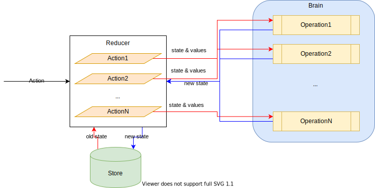

<p align="center">
  
</p>

<h1 align="center">Base code for a Web project in React and Typescript</h1>

[](LICENSE.txt)
[](https://github.com/gmullerb/basecode-react-ts)
[](https://gitlab.com/gmullerb/basecode-react-ts)


**A base code to start developing React apps with Typescript.**
__________________

## Quick Start

1. Clone (or download) the project, run:  
 `git clone https://github.com/gmullerb/basecode-react-ts`  
  or  
 `git clone https://gitlab.com/gmullerb/basecode-react-ts`  

2. Run `npm install` + `npm run check` or `./gradlew` to install npm dependencies and to check the project.

3. Run `npm start` or `./gradlew npm_start` to run the project.

4. Open browser at `localhost:8080`.

5. [Make it yours](#make-it-yours).

6. Start customizing it with your own ideas.

__________________

## Goals

This project is piece together with the purpose of:

* Providing a "well" documented base code from where to start developing [React](https://reactjs.org/) with [Typescript](https://www.typescriptlang.org/).
  * "Well" documented in order to give you a "deep" understanding of how things works and to ease customization of this start point [1].
* Providing basic elements for a Web app: Reducers, Router, Web Fetching, etc.
* Providing all the required toys at once: Typings, Linting, Testing, Coverage and E2E Testing.

> - Some things may be Opinionated based on best practices and professional experience.  
> - Some parts of the code may seen messy, careless, funny or dummy but the idea is to provide different scenarios, so this project can be the start for "any" project just removing things and not "adding" ( adding in this context means that the configuration is covered for "any case", no need to add something to configuration, which is usually an "exhausting" part).  
> - [1] If some configuration, some code, anything is not crystal clear, please create an [issue](https://gitlab.com/gmullerb/basecode-react-ts/issues) and I will "improve" documentation (Although the documentation is still a Work In Progress). Also, Some topics in the README files have _References_ so you can dig more into details.

## Features

* All in 1 project.
* Typings for Main source code.
* Code Style Checking.
  * for Main source code (Typescript, React & CSS).
  * for Test source code (Javascript & React).
  * for E2E Test source code (Javascript).
  * for Config code (Javascript).
* Test Driven Development.
  * Unit, Integration and End to end tests.
  * Code coverage checking.
* Internal REST API Server for playing.

__________________

## Inside the Code

### Tools been used

* Development environment:
  * [Node](https://nodejs.org/en)/[Npm](https://www.npmjs.com/), Node/Yarn 
    * or failing [Java](http://www.oracle.com/technetwork/java/javase/downloads) & [Gradle](https://gradle.org/).
      * with [Gradle Node plugin](https://plugins.gradle.org/plugin/com.moowork.node).
* Flux/Redux library:
  * Asynchronous/Synchronous React Reducer Provider with Hooks: [react-reducer-provider](https://www.npmjs.com/package/react-reducer-provider).
* Building:
  * [Webpack](https://webpack.js.org/).
* Code Style Checking:
  * Common checking ("All" files) with [lintspaces](https://www.npmjs.com/package/lintspaces).
  * Javascript: [ESlint](https://eslint.org).
    * Typescript: [@typescript-eslint](https://www.npmjs.com/package/@typescript-eslint/eslint-plugin).
    * Using the Custom set of rules of [eslint-plugin-base-style-config](https://www.npmjs.com/package/eslint-plugin-base-style-config).
  * CSS: [StyleLint](https://github.com/stylelint/stylelint)
* Test Driven Development:
  * Unit Test & Integration Test:
    * [Jest](https://jestjs.io/)
      * [Jasmine](https://jasmine.github.io)
    * [Enzyme](https://airbnb.io/enzyme)
  * End to end tests:
    * [Protractor](http://www.protractortest.org).
      * [Chromium](https://www.chromium.org/) or [Chrome](https://www.google.com/chrome/browser/desktop/) for Tests.
  * Code coverage checking:
    * [Jest](https://jestjs.io/)
      * [Istanbul](https://istanbul.js.org).

> This tools were selected based on my experience and perception of usability, can be noted that are a mixed, e.g. Typescript come from Microsoft, Jest come from React, Protractor come from Angular, among others Webpack, ESlint, etc., Although they came from "different worlds" together they provide a smooth, friendly and fast experience to the developer.

### Prerequisites

* [Node](https://nodejs.org/en)/[Npm](https://www.npmjs.com/), Node/Yarn or failing [Java](http://www.oracle.com/technetwork/java/javase/downloads) & [Gradle](https://gradle.org/).
* [Git](https://git-scm.com/downloads) (only if the project is going to be cloned).
* [Chromium](https://www.chromium.org/) or [Chrome](https://www.google.com/chrome/browser/desktop/) for E2E Tests.

### Getting it

Clone or download the project[1], in the desired folder execute:

```sh
git clone https://github.com/gmullerb/basecode-react-ts
```

or

```sh
git clone https://gitlab.com/gmullerb/basecode-react-ts
```

> [1] [Cloning a repository](https://help.github.com/articles/cloning-a-repository/)

### Make it yours

1. Create your repository at [Github](https://github.com), [Gitlab](https://gitlab.com) or any other.

2. Replace Git `origin` with yours (lets say it is `https://github.com/you/superb-react-ts-project`):

```sh
git remote rm origin
git remote add origin https://github.com/you/superb-react-ts-project.git
```

### Running it

#### Npm

Npm scripts, [`package.json`](../package.json):

* `transpile`: transpile main source files.
* `lint.common`: checks common style of "all" files.
* `lint.config`: checks eslint style of config files [1].
* `lint.src`: checks eslint style of main source files [1].
* `lint.css`: checks style of `.css` files.
* `lint.test`: checks eslint style of test source files [1].
* `start`: will build and run the Web App in Watch mode, and run the REST API Server.
* `test`: runs Jasmine/Jest tests.
* `test.watch`: runs Jasmine/Jest tests in Watch mode.
* etc.

Additionally:

* `npm run check`: will execute all tasks (`lint.common`, ..., `test`, etc.).
* `npm run`: will list all available script/task for the project.

> [1] Using rules from [eslint-plugin-base-style-config](https://www.npmjs.com/package/eslint-plugin-base-style-config).

##### From Gradle

Run any scripts using `./gradlew npm_run_.name.`, where `.name.` is the name of the npm script, e.g.:

`lint.common` => `./gradlew npm_run_lint.common`

### Folders structure

```
  /config
    /main
    /test
    /e2e
  /src
    /main
        **/___tests/
    /environments
    /typings
  /e2e
  /server
```

- `config/main`: Configuration files for Main source code.
- `config/test`: Configuration files for Tests.
- `config/e2e`: Configuration files for E2E Tests.
- `src/main`: Main source files.
- `src/**/___tests/`: Test source files[1].
- `src/environments`: Environment files.
- `src/typings`: Additional typings: Globals, CSS, png, and anything else that is required.
- `e2e`: E2E Test source files.
- `server`: Small REST API Server.

- `build/`: is a generated folder where build results are placed and also tests and coverage reports.

> [1] Tests folders are inside `src/main` mainly for Maintainability, 2 reasons: Keep Close (Easy to find the associated Tests) and Easy to Remove (When a component is removed, just remove the "folder"). There are several strategies defined in the project to avoid using or including these folders and Test files in final bundling.

### Files conventions

- `*.ts`: Typescript main source files.
- `*.tsx`: Typescript React main source files.
- `*.test.js`: Javascript Test (Unit and/or Integration) source files [1].
- `*.test.jsx`: React test source files [1].
- `*.e2e.js`: React test source files [1].
- `*.css`: Just the CSS files [2].

* Folder's name should use `_`, but not `-`.
* Files' name should use `-`, but not `_`.

> [1] There is no need for using typings in Test files, seems unnecessary and in some cases can be "time" consuming and/or harmful.  
> I defined a generic type for all css, that is better than using individual `.css.d.ts` files, check [`css-declaration.d.ts`](src/typings/css-declaration.d.ts).

### App Structure

App uses:

* Asynchronous/Synchronous React Reducer Provider with Hooks: [react-reducer-provider](https://www.npmjs.com/package/react-reducer-provider).
* [React Router](https://reacttraining.com/react-router/web/guides/quick-start).

[`RoutedContainer.tsx`](src/main/back/RoutedContainer.tsx) is where the Flux/Redux + Router magic happens, by combining:

* [`GlobalReducerProvider`](src/main/GlobalReducerProvider.tsx)

* [`BrowserRouter`](https://reacttraining.com/react-router/web/api/BrowserRouter) 

* and different [`Route`s](https://reacttraining.com/react-router/web/api/Route)

Main Components:

* [AsyncCounter.tsx](src/main/counter/AsyncCounter.tsx) uses a Local Asynchronous React Reducer ([react-reducer-provider](https://www.npmjs.com/package/react-reducer-provider)).
* [RestEcho.tsx](src/main/echo/RestEcho.tsx) uses REST Services and CSS Modules.

> Function components and Hooks are the preferred approach for React Components, is even encourage through linting.

* [variable.css](src/main/variable.css) contains Global CSS values.

#### Brain pattern

Since reducer functions tends to be big, extracting operation to its own module is recommended, leaving only a switch with a "lot" of function calls. This pattern will increase Readability, Maintainability and Testability:



e.g. :

[`CounterActions.ts`](src/main/counter/CounterActions.ts):

```ts
async function reduce(prevState: DeepReadonly<CounterState>, action: CounterAction): Promise<DeepReadonly<CounterState>> {
  switch (action) {
    case CounterAction.UP:
      return goUp(prevState)
    case CounterAction.DOWN:
      return goDown(prevState)
    default:
      return prevState
  }
}
```

and its brain:
[`counterBrain.ts`](src/main/counter/counterBrain.ts):

```ts
async function goUp(prevState: DeepReadonly<CounterState>): Promise<DeepReadonly<CounterState>> {
  return delay(750, {
    value: {
      count: prevState.count + 1,
      updatedAt: new Date()
    }
  })
}

async function goDown(prevState: DeepReadonly<CounterState>): Promise<DeepReadonly<CounterState>> {
  return delay(750, {
    value: {
      count: prevState.count - 1,
      updatedAt: new Date()
    }
  })
}
```

> (and it is applicable in other contexts)

#### Extract Form pattern

Instead of using `ref` everywhere, use `name`s and extractor:

1 . Define a `const enum` with the names of the fields:

```typescript
const enum SomeFormFieldsName {
  field1 = 'name1',
  fieldN = 'nameN',
}
```

2 . Use in form fields:

```jsx
<input
  name={SomeFormFieldsName.field1}
  type='text'
/>
<input
  name={SomeFormFieldsName.fieldN}
  type='text'
/>
```

3 . Define an extractor function:

```typescript
function extractData(form: HTMLFormElement): SomeData {
  return {
    field1: (form[SomeFormFieldsName.field1] as HTMLInputElement).value
    fieldN: (form[SomeFormFieldsName.fieldN] as HTMLInputElement).value
  }
}
```

Optional . Define an processor function that stops propagation and default:

```typescript
function processForm(event: React.FormEvent<HTMLFormElement>): HTMLFormElement {
  event.preventDefault()
  event.stopPropagation()
  return event.currentTarget
}
```

4 . Use it `onSubmit`:

```jsx
<form
  onSubmit={async event => handleSubmit(extractData(processForm(event)))}
>
```

> Can be used with any type of form field, although in here is only shown with `input`.

#### Tests

Tests are presented as a starting point, i.e. tests may not cover all possible cases, neither Unit & Integration tests, nor E2E tests.

> Coverage thresholds should be raise and/or sets to the specific project needs.

##### Unit & Integration Test

Test Files name ends with `.test.js` and are written using mainly [jasmine](https://jasmine.github.io)(and some [jest](https://jestjs.io/)) and [enzyme](https://airbnb.io/enzyme), and run with [jest](https://jestjs.io/) [1].

> [1] A mix of unit and integration tests is done, If desired then they could be separated as it is done in [basecode - front](https://github.com/gmullerb/basecode/tree/master/front).  

##### E2E

E2E Test Files name ends with `.e2e.js` and are written using [jasmine](https://jasmine.github.io) and [protractor](http://www.protractortest.org).

Configuration is defined in: [protractor.config.js](config/e2e/protractor.config.js)

* E2E tests with Protractor requires `browser.ignoreSynchronization = true` to allow e2e for **non-angular apps**.
* Two reporters are set:
  * `SpecReporter` from jasmine-spec-reporter is set for console report.
  * `JUnitXmlReporter` from jasmine-reporters for XML report, mainly for CI.
* Headless chrome can be used, if desired:

```js
capabilities: {
  browserName: 'chrome',
  chromeOptions: {
    args: [ '--headless' ]
  }
}
```

* If working as a root, then use No-sandbox Chrome [1]:

```js
capabilities: {
  browserName: 'chrome',
  chromeOptions: {
    args: [ '--no-sandbox' ]
  }
}
```

> [1] This can be set even if not running e2e as a root, useful for Local and CI.

### Webpack configuration

Basically Webpack module rules are defined:

a. `reactRule` for processing `.tsx` files:

```js
const reactRule = {
  test: /\.tsx$/,
  use: {
    loader: "babel-loader",
    options: {
      presets: ["@babel/preset-react", "@babel/preset-typescript"]
    }
  }
}
```

b. `cssRule` to been able to import `.css` files:

```js
const cssRule = {
  test: /\.css$/,
  use: [
    'style-loader',
    { loader: 'css-loader',
      options: {
        modules: true,
        importLoaders: 1,
        sourceMap: true
      }
    },
    'postcss-loader'
  ]
}
```

### CI Configuration

CI Configuration can be checked at [gitlab-ci.yml](.gitlab-ci.yml) and Real results can be check at [Gitlab pipelines](https://gitlab.com/gmullerb/basecode-react-ts/pipelines).

__________________

## Documentation

* Code should be "self-documented", but add documentation were given complexity is high or misunderstanding may happened.
* [`CHANGELOG.md`](CHANGELOG.md): ONLY to add information of NOTABLE changes for each version here, chronologically ordered [1].

> [1] [Keep a Changelog](http://keepachangelog.com)

## Contributing

* **Use it**.
* **Share it**.
* [Give it a Star :start:](https://github.com/gmullerb/react-reducer-provider).
* [Request more documentation](https://github.com/gmullerb/react-reducer-provider/issues).
* [Propose changes or improvements](https://github.com/gmullerb/react-reducer-provider/issues).
* [Report bugs](https://github.com/gmullerb/react-reducer-provider/issues).

## License

[MIT License](LICENSE.txt)
__________________

## Remember

* Use code style verification tools => Encourages Best Practices, Efficiency, Readability and Learnability.
* Start testing early => Encourages Reliability and Maintainability.
* Code Review everything => Encourages Functional suitability, Performance Efficiency and Teamwork.

## Additional words

Don't forget:

* **Love what you do**.
* **Learn everyday**.
* **Learn yourself**.
* **Share your knowledge**.
* **Learn from the past, dream on the future, live and enjoy the present to the max!**.
* **Enjoy the quest** (It's where you learn and grow).

At life:

* Let's act, not complain.
* Be flexible.

At work:

* Let's give solutions, not questions.
* Aim to simplicity not intellectualism.
